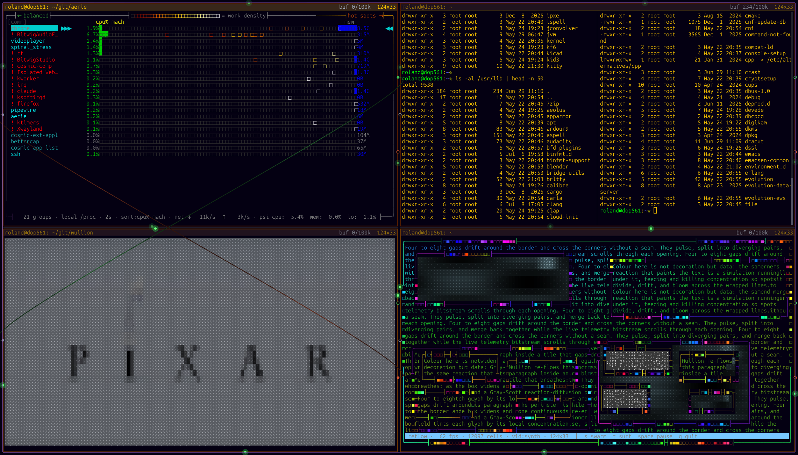
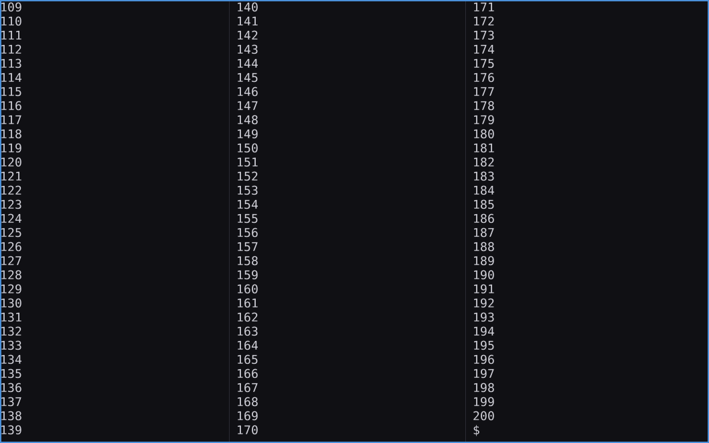

# rt

A fast, **Wayland-native** (and fully **X11-capable**) tiling terminal multiplexer,
built on its **own in-house VT engine** — a from-scratch ANSI parser and terminal grid,
verified cell-for-cell against [`alacritty_terminal`](https://crates.io/crates/alacritty_terminal)
and faster than it — with a custom OpenGL glyph renderer and an egui chrome layer. A loose
port of [Terminator](https://gnome-terminator.org/)'s ideas.

One binary runs on both display backends and prefers **native Wayland** when a Wayland
session is present (never XWayland), falling back to X11 otherwise.



## The engine

rt reads and renders terminal output with **`vt-parser` + `vt-term`**, an in-house VT/ANSI
engine written from scratch instead of leaning on a black box:

- **Verified, not hoped.** Every step is checked by *differential testing* against
  `alacritty_terminal` as an oracle — feed both the same bytes, then compare the resulting
  grid, cursor, modes, wide-glyph placement, charsets, and scrollback **cell-for-cell**.
  The result is **0 divergences** across 10 000+ generated scripts (in *every* chunk
  framing, which stresses sequence- and UTF-8-resumption), a spec suite, and real-world
  captures. Where alacritty has a quirk, the engine matches the quirk — it is the
  reference, not the abstract spec.
- **Faster than what it replaces.** Six measured optimisation passes — occupied-length
  clearing, a packed 16-byte cell, batched printing, stack-allocated CSI params, an ASCII
  width fast-path, and a malloc-free recycling scroll — put the Term ahead of the vendored
  alacritty engine on throughput: **geomean ~1.2× on x86-64 and ~1.05× on riscv-64**
  (plain text ~1.9×), across representative workloads. Correctness stayed pinned at 0
  divergences through every pass.
- **The parser, too.** `vt-parser` is a complete VT500/Williams state machine that beats
  the `vte` parser it replaces (~1.1×), including synchronized updates (DECSET 2026) — a
  gap the differential harness caught that fuzzing never would.

The vendored `alacritty_terminal` / `vte` forks stay in-tree as the differential-testing
**oracle** and a selectable backend. rt uses the in-house engine by default and **announces
its active engine on startup**; `RT_ENGINE=alacritty rt` switches to the vendored engine to
compare. See [`docs/vt-term-design.md`](docs/vt-term-design.md) and
[`docs/vt-parser-design.md`](docs/vt-parser-design.md) for the design, and
[`docs/engine-divergence.md`](docs/engine-divergence.md) for the (short) list of known
edges still being driven to zero.

## Features

- **Panes & tabs** — split any way, keyboard- or mouse-driven, Terminator keybindings.
- **Newspaper columns** — flow one pane's output into side-by-side columns so a wide screen shows *more rows at once*, newspaper-style (`Ctrl+.` / `Ctrl+,`). See below.
- **Scrollback search** — `Ctrl+Shift+F`; configurable buffer up to 20M lines, with a live memory meter.
- **Broadcast** — type once, reach a pane group or every pane.
- **Border instruments** — live gauges on each pane's edge: output flow, CPU heat (blackbody), render latency. Idle-throttled, so they cost nothing when nothing's happening.
- **Patch-bay** — wire panes' stdin/stdout/stderr to each other via `$RT_OUT` / `$RT_ERR` / `$RT_IN` (real named pipes). The animated wires *are* the bytes.
- **Mouse** — full support, including forwarding to mouse-aware TUIs (vim, htop, …); hold **Shift** to override and use rt's own selection/scroll. Draggable scrollbar.
- **Background blur** — compositor blur where available (Wayland `ext-background-effect-v1` / KDE; X11 `_KDE_NET_WM_BLUR_BEHIND_REGION`).
- **Scheme-aware chrome** — per-pane headers derived from your own foreground/background colours.

Press **F1** in rt for the full built-in manual.

### Newspaper columns — use that wide screen

Modern displays are wide, but a terminal only fills them with *columns*, not
*rows* — so `less`, a build log, or `git log` leaves the bottom two-thirds of a
27-inch screen blank. rt's **newspaper columns** flow a single pane's output into
two, three, or more side-by-side columns: text runs down the first column, then
continues at the top of the next, exactly like a newspaper. One `Ctrl+.` doubles
how much scrollback you see at a glance; `Ctrl+,` folds it back.



It's transparent to the program underneath — it just sees an ordinary scrollback
scroll — so it works with anything: `man` pages, `cat` of a long file, logs, `vim`.

## Build & install

Requires a stable Rust toolchain. On Debian/Ubuntu, the build needs a few dev libraries:

```sh
sudo apt install libwayland-dev libxkbcommon-dev libxcb1-dev libx11-dev libgl1-mesa-dev libfontconfig1-dev
```

Install the GUI terminal:

```sh
cargo install --path crates/rt                        # universal: Wayland + X11 (default)
cargo install --path crates/rt --no-default-features  # lean, Wayland-only (zero X11 crates)
```

The in-house engine is the default. To run the vendored alacritty engine instead — for a
one-off comparison or if you hit an edge — set `RT_ENGINE=alacritty` in the environment; rt
prints which engine it started with. (`RT_ENGINE=vtterm` forces the in-house engine.)

There's also a text-mode multiplexer that hosts the same panes inside any terminal:

```sh
cargo install --path crates/rt-mux
```

## Desktop integration

`cargo install` only places the binary. To get a launcher entry and icon (so rt
shows up in your application menu and the compositor binds its icon to the window):

```sh
extra/linux/install.sh              # user-local, ~/.local/share
extra/linux/install.sh --system     # system-wide, /usr/share (run with sudo)
extra/linux/install.sh --uninstall  # remove it again
```

This installs the [icon](extra/logo/rt.svg) into the hicolor theme and the
`io.github.perpetualbits.rt.desktop` entry, pinning `Exec` to your resolved `rt`
path. rt sets its Wayland `app_id` / X11 `WM_CLASS` to `io.github.perpetualbits.rt`,
which is what lets the compositor match the window to that icon.

## Configuration

Settings live in `$XDG_CONFIG_HOME/rt/config.toml` (or `~/.config/rt/config.toml`).
Right-click → **Preferences** edits them live.

## Credits

- **Terminal engine: in-house** — `vt-parser` + `vt-term` (this repo, GPL-3.0-or-later),
  verified against and benchmarked on the vendored **`alacritty_terminal`** / **`vte`**
  forks (Apache-2.0 / MIT), which remain in-tree as the differential-testing oracle and a
  selectable backend.
- Windowing, GL & UI: **winit, glutin, glow, egui, fontdue**, and the wayland-rs / x11rb / arboard stacks — MIT / Apache-2.0.
- Inspired by **Terminator** (GPLv2); its *behaviour* is reimplemented here, no code is copied (see `docs/REFERENCES.md`).

## License

**GPL-3.0-or-later.** See [`COPYING`](COPYING) for the full text.
